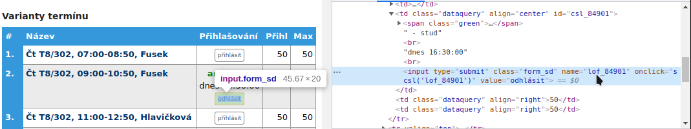

## Spustenie:

```shell
 $ ./registerExercises.py <loggin> <password> <minutes:hours>
```
ak posledný argument nie je zadaný tak sa čas registrovania nastavý na 00:00

### example:
```shell
 ./registerExercises.py xmrkva01 bomum3saju 30:00
```

## Konfigurácia:
Konfigurácia sa nachádza na začiatku scriptu registerExercises.py
```text
url = url stránky na ktorej sa registrácia nachádza
webDriverRefreshRate = udáva v sekundách obnovovaciu frekvenciu pri funciách ktoré prehľadávajú stránku
timeCorrection = skoršie / neskoršie registrovanie v sekúndách. minimálne -2 maximálne 60
registerButtonName = kliknutím pravého tlačidla myši na zvolený button cez ktorý si chceš registrovať termín
                     zvolíš "inspect" a skopíruješ name daného prvku.
```
 

## Implementácia:

```text
Pre fungovanie scriptu je nevyhnutné mať nainštalovaný prehliadač Google Chrome.
Samotné stiahnutie Chrome webdriver ako aj jeho aktualizovanie už prevedie automaticky pri spustení.

Script skenuje čas viditeľný na stránke wis.fit.vutbr.cz. Ak sa tento čas priblíži ku zadanému času o 2 sekundy,
tak si tieto 2 sekundy odpočíta pre istotu už samotný script a začne registrovať.
V nultej iterácií klikne na tlačidlo prihlásiť a obnový stránku.
Ak sa mu nepodarilo prihlásiť tak to skúša znovu a znovu až kým nedosiahne maximálny počet iterácií a to je 10.
Po každom obnovení stránky čaká až sa tlačidlo stane viditeľným až potom naň klikne.
Ak sa termín podarí registrovať tak skript na tlačidlo už nekliká.
```
